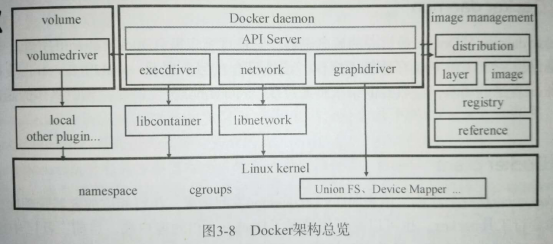
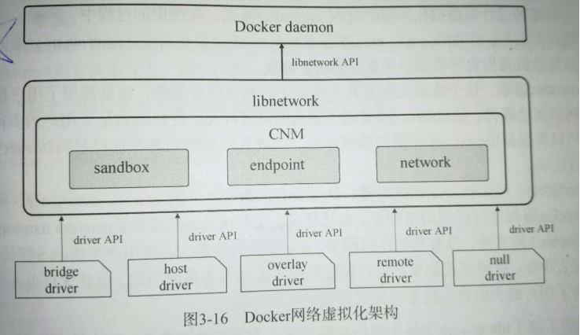

# 内核知识

Docker容器本质上是宿主机上的进程，Docker通过 `namespace` 实现了资源隔离，通过 `cgroups` 实现了资源限制，通过写时复制机制（`copy-on-write`）实现了高效的文件操作。

Docker需要实现以下6个方面的隔离

| namespace | 系统调用参数  | 隔离内容                   |
| --------- | ------------- | -------------------------- |
| UTS       | CLONE_NEWUTS  | 主机名与域名               |
| IPC       | CLONE_NEWIPC  | 信号量、消息队列和共享内存 |
| PID       | CLONE_NEWPID  | 进程编号                   |
| Network   | CLONE_NEWNET  | 网络设备、网络栈、端口等   |
| Mount     | CLONE_NEWMS   | 挂载点（文件系统）         |
| User      | CLONE_NEWUSER | 用户和用户组               |

# 架构图



Docker使用了传统的 `client-server` 架构模式，总架构图如上所示。用户通过Docker Client与Docker Daemon建立通信，并将请求发送给后者。而Docker的后端是松耦合结构，不同模块各司其职，有机结合，完成用户的请求。其中容器运行时、volume、镜像以及网络方面的具体实现已经放在daemon以外的模块或项目中。

# 镜像

## 镜像管理

- distribution模块：负责与Docker Registry交互，上传下载镜像以及存储与v2 registry有关的元数据。
- registry模块：负责与Docker Registry有关的身份验证、镜像查找、镜像验证以及管理registry mirror等交互操作。
- image模块：负责与镜像元数据有关的存储、查找，镜像层索引、查找以及镜像tar包有关的导入、导出等操作。
- reference模块：负责存储本地所有镜像的repository和tag名，并维护与镜像ID之间的映射关系。
- layer模块：负责与镜像层与容器层元数据有关的增删改查，并负责将镜像层的增删改查操作映射到实际存储镜像层文件系统的 `graphdriver` 模块。

## 镜像的主要特点

- 分层：分层达到了在不同镜像之间共享镜像层的效果，提高了镜像的构建、存储和分发的效率，节省了时间和存储空间。
- 写时复制：在多个容器之间共享镜像。每个容器在启动的时候并不需要单独复制一份镜像文件，而是将所有镜像层以只读的方式挂载到一个挂载点，再在上面覆盖一个可读写的容器层。
  - 每个运行中的容器主要由三个部分组成：只读层（read-only layer）、init-layer和可读写部分（read-write layer以及volumes）。
- 内容寻址：根据文件内容来索引镜像和镜像层。对于来自不同构建的镜像层，只要拥有相同的内容哈希，也能被不同的镜像共享。
- 联合挂载：联合挂载技术可以在一个挂载点同时挂载多个文件系统，将挂载点的原目录与被挂载内容进行整合，使得最终可见的文件系统会包含整合之后的各层的文件和目录。

## 镜像关键概念

- registry：用以保存Docker镜像，其中还包括镜像层次结构和关于镜像的元数据。可以将registry简单地想象成类似于Git仓库之类的实体。
- repository：是一个镜像集合，其中包含了多个不同版本的镜像，使用标签进行版本区分。
- manifest（描述文件）：主要存在于registry中作为Docker镜像的元数据，在 `pull`、`push`和`load` 中作为镜像结构和基础信息的描述文件。
- image（镜像）：用来存储一组镜像相关的元数据信息，主要包括镜像的架构（如`amd64`）、镜像默认配置信息、构件镜像的容器配置信息、包含所有镜像层信息的 `rootfs`。
- layer（镜像层）：是一个Docker用来管理镜像层的中间概念。可以被多个镜像共享。主要存放了镜像层的 diff_id、size、cache-id和parent等内容。
- Dockerfile：是在通过 `docker build` 命令构建自己的Docker镜像时需要使用到的定义文件。

## 镜像构建

可以通过两种方式构建镜像：`docker commit`、`docker build`。

### docker commit

将容器提交为一个镜像，也就是从容器更新或者构建镜像。需要执行的步骤如下：

1. 根据用户输入 `pause` 参数的设置确定是否暂停该docker容器的运行。
2. 将容器的可读写层导出打包，该读写层代表了当前运行容器的文件系统与当初启动该容器的镜像之间的差异。
3. 在层存储（`layerStore`）中注册可读写层差异包。
4. 更新镜像历史信息和 `rootfs`，并据此在镜像存储（`imageStore`）中创建一个新的镜像，记录其元数据。
5. 如果指定了 `repository` 信息，则给上述镜像添加 `tag` 信息。

### docker build

主要使用 `Dockerfile` 文件和 `docker build` 命令来完成一个新镜像的构建（基于某个基础镜像）。`docker build`可以接收3种类型的参数：PATH、-、URL，表示构建上下文 `context` 的3种来源。==一般情况下，将本机的一个包含Dockerfile的目录中的所有内容作为上下文==

#### 构建流程

Docker Client负责准备`context`，如果参数是一个URL则需要进行相应的下载操作。

Docker server接收到HTTP请求后，需要做如下的工作：

1. 创建一个临时目录，并将`context`指定的文件系统解压到该目录下。
2. 读取并解析`Dockerfile`。
3. 根据解析出的`Dockerfile`遍历其中的所有指令，并分发到不同的模块（`parser`）去执行。
4. `parser`为上述每一个指令创建一个对应的临时容器，在临时容器中执行当前指令，然后通过 `commit` 使用此容器生成一个镜像层。
5. `Dockerfile`中所有指令对应的层的集合，就是此次 build 后的结果。最后一个 `commit`生成的镜像ID就会作为最终的镜像ID返回。

#### 构建流程加速

- Docker daemon会缓存构建过程中的中间镜像。
- 将Dockerfile中的下一条指令和基础镜像的所有子镜像做比较，如果有一个子镜像是由相同的指令生成的，则命中缓存，直接使用该镜像。COPY和ADD指令的比较稍有不同，除了对比指令字符串，还要对比容器中的文件内容和ADD、COPY所添加的文件内容是否相同。
- 镜像构建过程中，一旦缓存失效，则后续的指令都将生成新的镜像，而不再使用缓存。

# Docker数据卷

## 需要解决的问题

- 容器中的文件在宿主机上存在形式复杂（因为联合挂载），不能在宿主机上很方便地对容器中的文件进行访问。
- 多个容器之间的数据无法共享。
- 当删除容器时，容器产生的数据将丢失。

## 使用方式

### 明确创建和挂载

```bash
# 创建命名的volume
docker volume create --name vol_simple
# 使用已存在的volume进行挂载
docker run -d -v vol-simple:/data ubuntu /bin/bash
# 生成随机名称的volume进行挂载
docker run -d -v /data ubuntu /bin/bash
```

Docker在创建 `volume` 的时候会在宿主机 */var/lib/docker/volumes/* 中创建一个以 volume ID 为名的目录，并将volume中的内容存储在名为 *_data* 的目录下。

### 将主机目录挂载到容器中

```bash
docker run -d -v /host/dir:/container/dir ubuntu /bin/bash
# 只读挂载
docker run -d -v /host/dir:/container/dir:ro ubuntu /bin/bash
# 非共享挂载，共享挂载是默认行为
docker run -d -v /host/dir:/container/dir:Z ubuntu /bin/bash
```

### Dockerfile VOLUME

可以设置多个，但是下面这个Dockerfile构建出来的镜像中 volume 目录将会是一个空目录。

```dockerfile
FROM ubuntu
RUN useradd foo
VOLUME /data
# 这里的文件将不会生效
RUN touch /data/file
RUN chown -R foo:foo /data
```

==因为镜像的构建过程中会为每一条命令生成一个临时容器并在该容器中执行命令，然后通过 `commit` 来生成镜像层，而 `commit`生成的镜像层不会包含 volume 中的内容，所以上述 `RUN touch /data/file` commit出来的镜像层并不包含 file 文件。==

### 共享volume（--volumes-from）

在启动容器的时候使用 `--volumes-from` 标签使得容器与已有的容器共享 `volume`。

### 备份与恢复

数据卷中的数据推荐的备份与还原方式

```bash
# 备份
docker run -rm --volumes-from vol_simple -v ${pwd}:/backup ubuntu tar cvf /backup/data.tar /data
# 恢复
docker run -rm --volumes-from vol_bck -v ${pwd}:/backup ubuntu tar xvf /backup/data.tar -C /
```

# Docker网络管理



