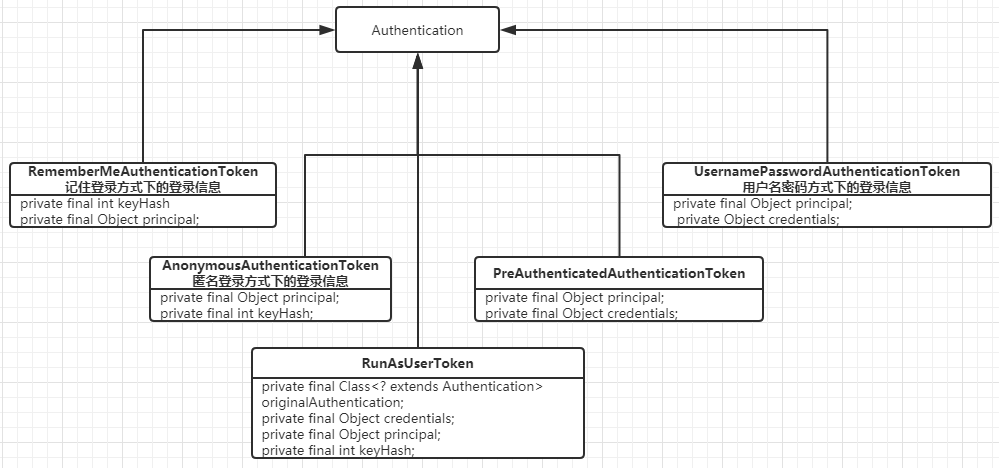

# Authentication

携带用户登录信息的类都必须实现该接口。主要包含以下几个信息：

```java
public interface Authentication extends Principal, Serializable {
    // 登录账号
    Object getPrincipal();
    // 登录凭据
    Object getCredentials();
    // 登录详细信息
    Object getDetails();
}
```

下面是认证之后需要设置的内容

```java
public interface Authentication extends Principal, Serializable {
	// 该登录用户所拥有的授权
    Collection<? extends GrantedAuthority> getAuthorities();
    // 是否认证通过
    boolean isAuthenticated();
}
```

## 内置实现



其中，`AnonymousAuthenticationToken` 、`RememberMeAuthenticationToken` 和 `RunAsUserToken` 默认是创建后即为认证通过的。

# AuthenticationProvider

这个是消费 `Authentication` 的地方，在同一个应用里可以提供多种不同的 `AuthenticationProvider` 来处理不同的登录方式。

```java
public interface AuthenticationProvider {
    // 判断Provider支持哪些类型的 Authentication 的认证
    boolean supports(Class<?> authentication);
    // 对自身支持的 Authentication 进行认证，认证成功后返回一个已认证的 Authentication ，否则抛出 AuthenticationException 异常
    Authentication authenticate(Authentication authentication)
			throws AuthenticationException;
}
```

## 内置实现

