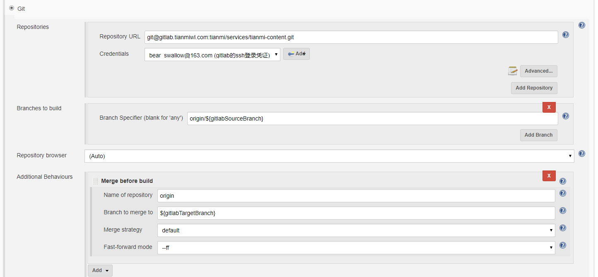

# 插件

## publish over SSH

使用参考文章 https://blog.csdn.net/tototuzuoquan/article/details/78568655。

该插件可以执行两种操作：将文件上传到远程linux服务器；向远程linux服务器发送命令并执行。

在jenkins pipeline执行的前后都可以触发publish over SSH。

### 主要命令

```bash
ssh-keygen -t rsa

```

# gitlab branch分支自动发布

需要进行如上的配置，账号使用ssh方式。
