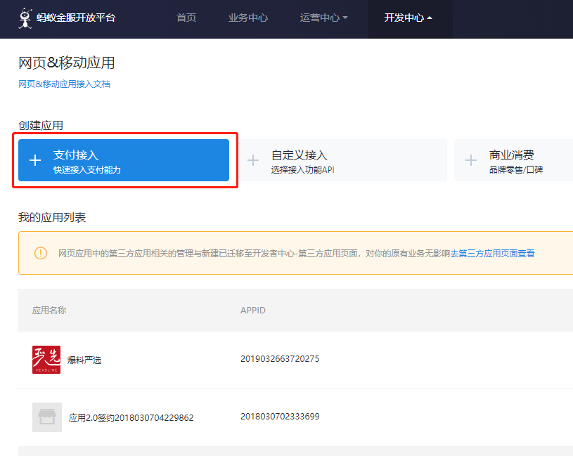
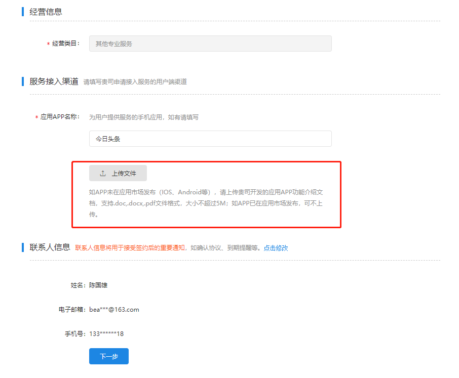
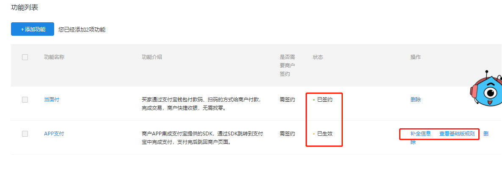
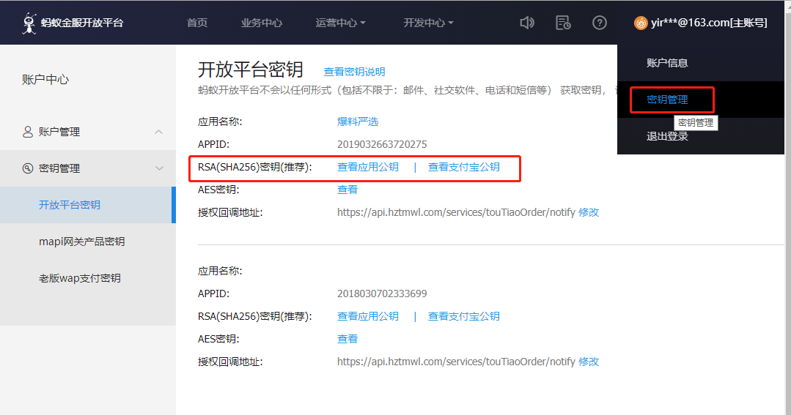

# 1. 字节跳动小程序

首先参考小程序对于支付这一块的说明：<https://developer.toutiao.com/docs/payment/>。这里可以了解小程序中支付的整个流程。

然后再参考发起头条支付的说明：<https://developer.toutiao.com/docs/open/requestPayment.html>，在这里可以调用支付接口的各种注意事项，也说明了需要参考蚂蚁金服开放平台的文档。

# 2. 蚂蚁金服开放平台

蚂蚁金服开放平台文档主要参考 [App支付](<https://docs.open.alipay.com/204/105465/>) 相关的文档。

## 2.1 创建应用

网址：<https://openhome.alipay.com/platform/appManage.htm#/apps>

创建 **支付接入** 类型的应用

按要求填写创建表单即可完成应用的创建，但是应用需要提交审核，一般在24小时内会完成审核。

## 2.2 签约App支付

在应用列表中，找到需要用于字节跳动小程序进行支付宝支付的应用，按上图指定步骤对 **APP支付** 进行签约，添加 **APP支付** 功能本身也需要进行审核，如果应用还未提交审核，则添加后一同提交审核。

在添加界面需要上传app的说明文档，以便审核时使用，要不然签约不会成功（这时已经生效，但是有时间和额度上的限制）

## 2.3 签名设置

教程：<https://docs.open.alipay.com/291/105971/>。

根据教程，生成秘钥和公钥，然后对上一步审核通过的应用进行设置，进入该地址：<https://openhome.alipay.com/platform/keyManage.htm>

设置完签名就可以得到 应用公钥、应用私钥和支付宝公钥，这些都是支付过程中需要使用的。

## 2.4 问题排查

异步回调文档：<https://docs.open.alipay.com/204/105301/>。

查询联调日志：<https://openmonitor.alipay.com/acceptance/cloudparse.htm>，必须使用应用的签约账号才能查看应用的联调日志。

云排查工具说明：<https://openclub.alipay.com/read.php?tid=1132&fid=25>。

收不到异步通知自查方案：<https://openclub.alipay.com/read.php?tid=1677&fid=25&page=1>。