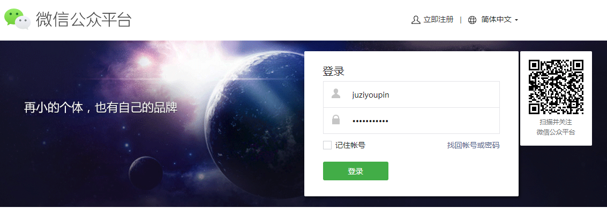
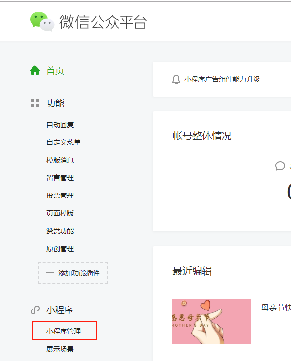
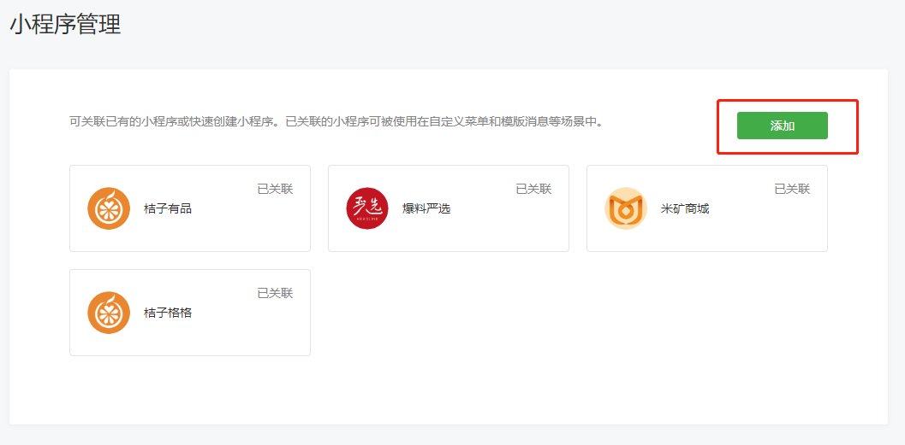
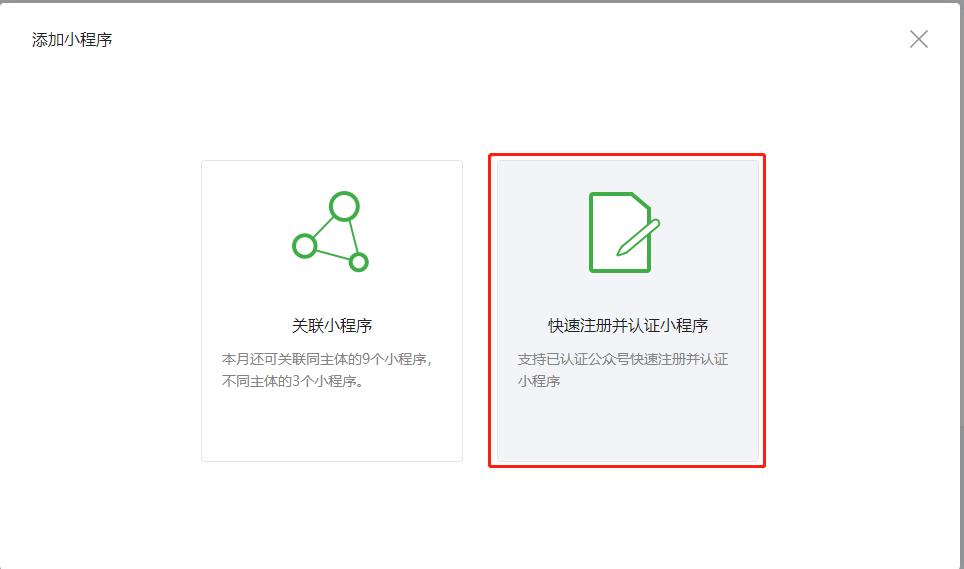
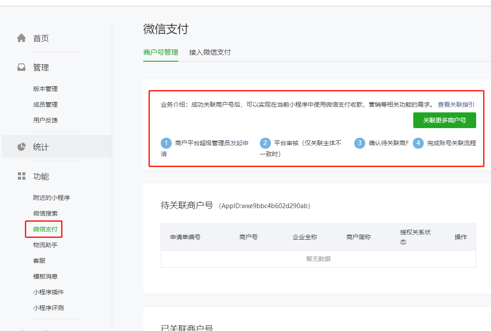

# 注册微信小程序

注册微信小程序有两种方式：直接注册小程序 和 微信公众号快捷创建。

## 直接注册小程序

网址：<https://mp.weixin.qq.com/cgi-bin/registermidpage?action=index&lang=zh_CN&token=>。然后按照要求填写申请表单即可。最后需要缴费300元进行认证。

## 微信公众号快捷创建

微信公众号登录页面：<https://mp.weixin.qq.com/?token=&lang=zh_CN>，必须使用管理员扫码登录才可快捷创建小程序。

登录之后，进入【小程序管理】

直接【添加】即可

# 开通微信支付商户号

开通地址：<https://pay.weixin.qq.com/index.php/apply/applyment_home/guide_normal>

# 开通小程序支付功能

登录小程序后到【微信支付】页面

根据右上红框中的提示完成商户号关联。