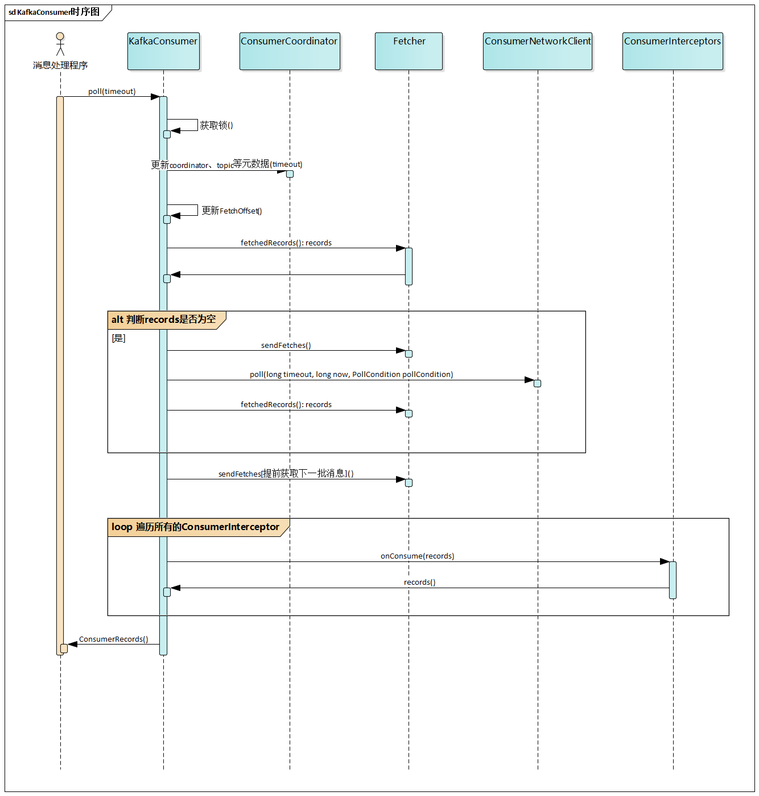

# 主要流程



# 核心类

## KafkaConsumer

完整类名：`org.apache.kafka.clients.consumer.KafkaConsumer`

`KafkaConsumer` 不是线程安全的。

```java
public class KafkaConsumer<K, V> implements Consumer<K, V> {
    // 消费者群组协调器，主要负责使用subscribe方式时为群组中的所有消费者自动分配Partition。
    // 执行真正的offset提交
    // 心跳维持
    private final ConsumerCoordinator coordinator;
    // 消息消费流程的拦截器列表
    private final ConsumerInterceptors<K, V> interceptors;
    // 真正向broker获取消息的对象
    private final Fetcher<K, V> fetcher;
    // 当前消费者的所有订阅信息
    private final SubscriptionState subscriptions;
    // broker以及broker中的topic元数据
    private final Metadata metadata;
    
    // currentThread holds the threadId of the current thread accessing KafkaConsumer
    // and is used to prevent multi-threaded access
    private final AtomicLong currentThread = new AtomicLong(NO_CURRENT_THREAD);
    // refcount is used to allow reentrant access by the thread who has acquired currentThread
    private final AtomicInteger refcount = new AtomicInteger(0);
    
    @Override
    public void subscribe(Pattern pattern, ConsumerRebalanceListener listener) {
        acquire();
        try {
            if (pattern == null)
                throw new IllegalArgumentException("Topic pattern to subscribe to cannot be null");
            log.debug("Subscribed to pattern: {}", pattern);
            this.subscriptions.subscribe(pattern, listener);
            // 需要获取所有topic的元数据，所以KafkaConsumer的pattern订阅模式是通过不停的获取broker中所有topic的元数据，然后动态的订阅满足pattern的topic。
            this.metadata.needMetadataForAllTopics(true);
            this.metadata.requestUpdate();
            this.coordinator.updatePatternSubscription(metadata.fetch());
        } finally {
            release();
        }
    }
}
```

## ConsumerCoordinator

## Fetcher

# 请求

`KafkaConsumer` 中的请求都是异步请求，基于 Java NIO 实现的。

## RequestFuture

完整类名：`org.apache.kafka.clients.consumer.internals.RequestFuture`。

```java
public class RequestFuture<T> implements ConsumerNetworkClient.PollCondition {
    private static final Object INCOMPLETE_SENTINEL = new Object();
    // 标识该请求是否已经完成，没有完成时获取到的值肯定是INCOMPLETE_SENTINEL
    private final AtomicReference<Object> result = new AtomicReference<>(INCOMPLETE_SENTINEL);
    // 可以监听请求，在请求完成时需要调用监听器进行处理。
    private final ConcurrentLinkedQueue<RequestFutureListener<T>> listeners = new ConcurrentLinkedQueue<>();
    
    // compose其实是通过RequestFutureListener完成的
    // 因为它的返回值还是一个RequestFuture，所以可以进行链式操作
    public <S> RequestFuture<S> compose(final RequestFutureAdapter<T, S> adapter) {
        final RequestFuture<S> adapted = new RequestFuture<>();
        addListener(new RequestFutureListener<T>() {
            @Override
            public void onSuccess(T value) {
                adapter.onSuccess(value, adapted);
            }

            @Override
            public void onFailure(RuntimeException e) {
                adapter.onFailure(e, adapted);
            }
        });
        return adapted;
    }
    
    // chain其实也是通过RequestFutureListener完成的
    public void chain(final RequestFuture<T> future) {
        addListener(new RequestFutureListener<T>() {
            @Override
            public void onSuccess(T value) {
                future.complete(value);
            }

            @Override
            public void onFailure(RuntimeException e) {
                future.raise(e);
            }
        });
    }
    
    // 添加一个RequestFutureListener时，如果请求已经完成就会马上触发失败或成功处理，即该RequestFutureListener中相应的方法立即会被调用。
    public void addListener(RequestFutureListener<T> listener) {
        this.listeners.add(listener);
        if (failed())
            fireFailure();
        else if (succeeded())
            fireSuccess();
    }
}
```

它还提供了很多静态方法用于快速生成各种 `RequestFuture`。

### RequestFutureAdapter

完整类名：`org.apache.kafka.clients.consumer.internals.RequestFutureAdapter`。

```java
// Adapt from a request future of one type to another.
public abstract class RequestFutureAdapter<F, T> {

    public abstract void onSuccess(F value, RequestFuture<T> future);

    public void onFailure(RuntimeException e, RequestFuture<T> future) {
        future.raise(e);
    }
}
```

### RequestFutureListener

完整类名：`org.apache.kafka.clients.consumer.internals.RequestFutureListener`。

```java
/**
 * Listener interface to hook into RequestFuture completion.
 */
public interface RequestFutureListener<T> {

    void onSuccess(T value);

    void onFailure(RuntimeException e);
}
```

## ConsumerNetworkClient

完整类名：`org.apache.kafka.clients.consumer.internals.ConsumerNetworkClient`。

```java
// Consumer客户端访问网络的封装层，该类是线程安全的。
public class ConsumerNetworkClient implements Closeable {
    
    // 发送请求时会将请求加入相应Node的请求列表，等待后续处理。
    private final Map<Node, List<ClientRequest>> unsent = new HashMap<>();
    // 所有broker以及topic元数据
    private final Metadata metadata;
    // 请求的响应返回时会先将其加入该队列，然后等待结果处理，避免死锁。
    private final ConcurrentLinkedQueue<RequestFutureCompletionHandler> pendingCompletion = new ConcurrentLinkedQueue<>();
    
    /**
     * 发送请求，但是并不会立即发送，而是存放到unsent中，等到poll方法被调用时才会真正的发送。
     */
    public RequestFuture<ClientResponse> send(Node node, ApiKeys api, AbstractRequest request) {
        return send(node, api, ProtoUtils.latestVersion(api.id), request);
    }
    
    private RequestFuture<ClientResponse> send(Node node, ApiKeys api, short version, AbstractRequest request) {
    	long now = time.milliseconds();
        RequestFutureCompletionHandler completionHandler = new RequestFutureCompletionHandler();
        RequestHeader header = client.nextRequestHeader(api, version);
        RequestSend send = new RequestSend(node.idString(), header, request.toStruct());
        // 将请求封装后添加到unset中，等待发送。
        put(node, new ClientRequest(now, true, send, completionHandler));

        // wakeup the client in case it is blocking in poll so that we can send the queued request
        client.wakeup();
        return completionHandler.future;
    }
    
    // 发送指定的请求，直到收到响应或者超时。
    public void poll(RequestFuture<?> future) {
        while (!future.isDone())
            poll(MAX_POLL_TIMEOUT_MS, time.milliseconds(), future);
    }
    
    /**
     * 发送任意请求，直到收到响应或者超时。
     * 在发送请求之前和之后都会调用firePendingCompletedRequests方法处理已完成的请求
     */
    public void poll(long timeout, long now, PollCondition pollCondition) {
        firePendingCompletedRequests();

        // 发送请求是一个互斥的操作
        synchronized (this) {
            // 发送所有已连接的Node中的待发送请求
            trySend(now);

            // check whether the poll is still needed by the caller. Note that if the expected completion
            // condition becomes satisfied after the call to shouldBlock() (because of a fired completion
            // handler), the client will be woken up.
            if (pollCondition == null || pollCondition.shouldBlock()) {
                // if there are no requests in flight, do not block longer than the retry backoff
                if (client.inFlightRequestCount() == 0)
                    timeout = Math.min(timeout, retryBackoffMs);
                client.poll(Math.min(MAX_POLL_TIMEOUT_MS, timeout), now);
                now = time.milliseconds();
            } else {
                client.poll(0, now);
            }

            // handle any disconnects by failing the active requests. 
            // note that disconnects must be checked immediately following poll since any subsequent call to client.ready() will reset the disconnect status
            checkDisconnects(now);

            // trigger wakeups after checking for disconnects so that the callbacks will be ready
            // to be fired on the next call to poll()
            maybeTriggerWakeup();

            // try again to send requests since buffer space may have been
            // cleared or a connect finished in the poll
            trySend(now);

            // fail requests that couldn't be sent if they have expired
            failExpiredRequests(now);
        }

        // called without the lock to avoid deadlock potential if handlers need to acquire locks
        firePendingCompletedRequests();
    }
    
    public void wakeup() {
        // wakeup should be safe without holding the client lock since it simply delegates to
        // Selector's wakeup, which is threadsafe
        this.wakeup.set(true);
        this.client.wakeup();
    }
    
    // 处理所有未处理的已完成请求
    private void firePendingCompletedRequests() {
        boolean completedRequestsFired = false;
        for (;;) {
            RequestFutureCompletionHandler completionHandler = pendingCompletion.poll();
            if (completionHandler == null)
                break;

            completionHandler.fireCompletion();
            completedRequestsFired = true;
        }

        // wakeup the client in case it is blocking in poll for this future's completion
        if (completedRequestsFired)
            client.wakeup();
    }
    
}
```

==存在疑问的地方==

- `KafkaClient#wakeup` 的作用。

### RequestCompletionHandler

完整类名：`org.apache.kafka.clients.RequestCompletionHandler`。

```java
/**
 * A callback interface for attaching an action to be executed when a request is complete and the corresponding response
 * has been received. This handler will also be invoked if there is a disconnection while handling the request.
 */
public interface RequestCompletionHandler {

    public void onComplete(ClientResponse response);

}
```

### RequestFutureCompletionHandler

完整类名：`org.apache.kafka.clients.consumer.internals.ConsumerNetworkClient.RequestFutureCompletionHandler`

```java
public class ConsumerNetworkClient implements Closeable {
    
    public class RequestFutureCompletionHandler implements RequestCompletionHandler {
        
        private final RequestFuture<ClientResponse> future;
        private ClientResponse response;
        // 如果请求处理出现异常则保存到这里
        private RuntimeException e;
        
        public RequestFutureCompletionHandler() {
            this.future = new RequestFuture<>();
        }
        
        // 当要处理请求结果时调用该方法，该方法会相应的触发future的完成
        public void fireCompletion() {
            if (e != null) {
                future.raise(e);
            } else if (response.wasDisconnected()) {
                ClientRequest request = response.request();
                RequestSend send = request.request();
                ApiKeys api = ApiKeys.forId(send.header().apiKey());
                int correlation = send.header().correlationId();
                log.debug("Cancelled {} request {} with correlation id {} due to node {} being disconnected",
                        api, request, correlation, send.destination());
                future.raise(DisconnectException.INSTANCE);
            } else {
                future.complete(response);
            }
        }
        
        // 不管请求成功还是失败都会将已完成的请求加入到pendingCompletion队列中，等待处理
        public void onFailure(RuntimeException e) {
            this.e = e;
            pendingCompletion.add(this);
        }

        @Override
        public void onComplete(ClientResponse response) {
            this.response = response;
            pendingCompletion.add(this);
        }
        
    }
    
}
```

## NetworkClient

完整类名：`org.apache.kafka.clients.NetworkClient`。

```java
/**
 * A network client for asynchronous request/response network i/o. This is an internal class used to implement the
 * user-facing producer and consumer clients.
 * This class is not thread-safe!
 */
public class NetworkClient implements KafkaClient {
    
    /* the selector used to perform network i/o */
    private final Selectable selector;
    
    /* the set of requests currently being sent or awaiting a response */
    private final InFlightRequests inFlightRequests;
    
    @Override
    public void send(ClientRequest request, long now) {
        String nodeId = request.request().destination();
        if (!canSendRequest(nodeId))
            throw new IllegalStateException("Attempt to send a request to node " + nodeId + " which is not ready.");
        doSend(request, now);
    }

    private void doSend(ClientRequest request, long now) {
        request.setSendTimeMs(now);
        // 发送后将该请求加入inFlightRequests中
        this.inFlightRequests.add(request);
        selector.send(request.request());
    }
    
    @Override
    public List<ClientResponse> poll(long timeout, long now) {
        long metadataTimeout = metadataUpdater.maybeUpdate(now);
        try {
            this.selector.poll(Utils.min(timeout, metadataTimeout, requestTimeoutMs));
        } catch (IOException e) {
            log.error("Unexpected error during I/O", e);
        }

        // process completed actions
        long updatedNow = this.time.milliseconds();
        List<ClientResponse> responses = new ArrayList<>();
        handleCompletedSends(responses, updatedNow);
        handleCompletedReceives(responses, updatedNow);
        handleDisconnections(responses, updatedNow);
        handleConnections();
        handleTimedOutRequests(responses, updatedNow);

        // invoke callbacks
        for (ClientResponse response : responses) {
            if (response.request().hasCallback()) {
                try {
                    response.request().callback().onComplete(response);
                } catch (Exception e) {
                    log.error("Uncaught error in request completion:", e);
                }
            }
        }

        return responses;
    }
    
}
```

# Consumer 状态

## PartitionStates

完整类名：`org.apache.kafka.common.internals.PartitionStates`。

存放 `TopicPartition` 状态的泛型类，可以执行各种操作。

```java
public class PartitionStates<S> {

    private final LinkedHashMap<TopicPartition, S> map = new LinkedHashMap<>();
}
```

## OffsetAndMetadata

完整类名：`org.apache.kafka.clients.consumer.OffsetAndMetadata`

```java
public class OffsetAndMetadata implements Serializable {
    private final long offset;
    private final String metadata;
}
```

在提交offset的时候可以添加附加数据。

## SubscriptionState

完整类名：`org.apache.kafka.clients.consumer.internals.SubscriptionState`

```java
public class SubscriptionState {
    
    private enum SubscriptionType {
        NONE, AUTO_TOPICS, AUTO_PATTERN, USER_ASSIGNED
    }
    
    /* the type of subscription */
    private SubscriptionType subscriptionType;
    /* the pattern user has requested */
    private Pattern subscribedPattern;
    /* the list of topics the user has requested */
    private Set<String> subscription;
    /* the list of partitions the user has requested */
    private Set<TopicPartition> userAssignment;
    // 消费者群组订阅的所有topic（leader会维护该集合，方便leader获取群组所订阅的所有topic的元数据） 
    private final Set<String> groupSubscription;
    /* the partitions that are currently assigned, note that the order of partition matters (see FetchBuilder for more details) */
    private final PartitionStates<TopicPartitionState> assignment;
    /* 是否需要获取初始的FetchOffset */
    private boolean needsFetchCommittedOffsets;
    /* Default offset reset strategy */
    private final OffsetResetStrategy defaultResetStrategy;
    /* Listener to be invoked when assignment changes */
    private ConsumerRebalanceListener listener;
    
    /**
     * 
     */
    public void assignFromUser(Set<TopicPartition> partitions){}
    /**
     * 自动分配时会调用该方法来初始化分配到的TopicPartition的状态
     */
    public void assignFromSubscribed(Collection<TopicPartition> assignments){}
    
}
```

这里面维护了某个 Consumer 订阅或分配的所有 TopicPartition 的状态，是进行 poll 和 元数据刷新的依据。

### TopicPartitionState

完整类名：`org.apache.kafka.clients.consumer.internals.SubscriptionState.TopicPartitionState`

```java
public class SubscriptionState {
    
    private static class TopicPartitionState {
        // last consumed position
        private Long position; 
        // last committed position
        private OffsetAndMetadata committed;  
        // whether this partition has been paused by the user
        private boolean paused;  
        // the strategy to use if the offset needs resetting
        private OffsetResetStrategy resetStrategy;
        
        private boolean isFetchable() {
            return !paused && hasValidPosition();
        }
    }
    
}
```

只有 isFetchable 判定为 true 的 TopicPartition（也就是没有暂停并且具有有效位置的 TopicPartition），下次 poll 的时候才会拉取该 TopicPartition 的消息。

# 可扩展

## ConsumerRebalanceListener

完整类名：`org.apache.kafka.clients.consumer.ConsumerRebalanceListener`

当发生 ConsumerRebalance 时会调用相应的方法。

```java
public interface ConsumerRebalanceListener {
    /**
     * 当发生重新分配前会触发该动作
     */
    public void onPartitionsRevoked(Collection<TopicPartition> partitions);
    /**
     * 当重新分配完成时会调用该动作
     */
    public void onPartitionsAssigned(Collection<TopicPartition> partitions);
    
}
```
## ConsumerInterceptor

完整类名：`org.apache.kafka.clients.consumer.ConsumerInterceptor`
```java
public interface ConsumerInterceptor<K, V> extends Configurable {
    // poll方法返回消息之前会调用该方法，该方法可以修改消息，但是不要依赖排在前面的ConsumerInterceptor返回的消息，因为前面的ConsumerInterceptor可以会失败。
    // ConsumerInterceptor处理失败后并不会将异常向上抛出，只会将异常记入log日志，然后使用上一个成功处理的结果继续下一个ConsumerInterceptor的处理。
    public ConsumerRecords<K, V> onConsume(ConsumerRecords<K, V> records);
    // 当offset提交成功后会调用该方法
    public void onCommit(Map<TopicPartition, OffsetAndMetadata> offsets);
    // 当Consumer的close方法被调用时会调用该方法
    public void close();
}
```

针对消息消费者在整个消费流程进行扩展的核心接口。

一般都是直接使用它的集合类 `org.apache.kafka.clients.consumer.internals.ConsumerInterceptors`。

## OffsetCommitCallback

完整类名：`org.apache.kafka.clients.consumer.OffsetCommitCallback`

```java
// offset异步提交完成后的回调接口
public interface OffsetCommitCallback {
    // 不管offset提交是否成功都会调用该方法
    void onComplete(Map<TopicPartition, OffsetAndMetadata> offsets, Exception exception);
}
```

## PartitionAssignor

完整类名：`org.apache.kafka.clients.consumer.internals.PartitionAssignor`

```java
public interface PartitionAssignor {
    // 消费群组中的一般消费者可以为自己订阅的topic添加一些用户数据，以便群组leader在进行partition分配时可以执行更加准确的分配机制。
    Subscription subscription(Set<String> topics);
    // 消费者群组leader完成分配后，group cooridinator将分配结果返回给相应的普通消费者时调用
    void onAssignment(Assignment assignment);
    // group cooridinator在接收到所有成员的订阅信息后，将所有订阅消息发送给消费者群组leader进行partition分配时调用
    Map<String, Assignment> assign(Cluster metadata, Map<String, Subscription> subscriptions);
}
```

# ==有疑问的地方==

- `KafkaConsumer#wakeup` 的作用是什么？

