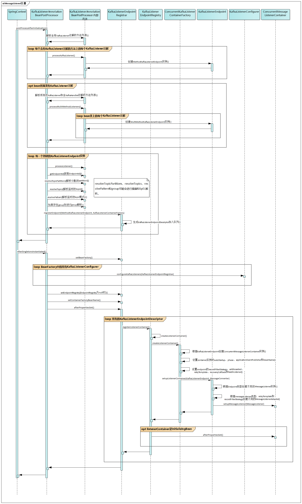

# 流程

## 注册流程



## 启动流程

# 注解及处理

## 注解

### @KafkaListener

完整类名：`org.springframework.kafka.annotation.KafkaListener`。

```java
@Target({ ElementType.TYPE, ElementType.METHOD, ElementType.ANNOTATION_TYPE })
@Retention(RetentionPolicy.RUNTIME)
@MessageMapping
@Documented
@Repeatable(KafkaListeners.class)
public @interface KafkaListener {
    // container的唯一标识，也是注册到Spring的beanName，如果没有设置，则会使用默认的生成规则来生成一个唯一的值。
    String id() default "";
    // container工厂类名称，如果未指定则使用默认的container工厂
    String containerFactory() default "";
    // 监听的topic数组。可以是字符串常量、property占位符和SpEL表达式。
    // 但是最终都要解析成topic
    String[] topics() default {};
    // 监听的topic模式。可以是字符串常量、property占位符和SpEL表达式。
    String topicPattern() default "";
    // 分配给该监听器的partition数组，与topics和topicPattern互斥
    TopicPartition[] topicPartitions() default {};
    // container分组，如果设置，则可以对指定分组的container进行start/stop操作
    String group() default "";
}
```

设置 `topics` 和 `topicPattern` 就等于开启了 KafkaConsumer 的 subscription 模式。

设置 `topicPartitions` 就等于开启了 KafkaConsumer 的 assign 模式。

可以在类或者方法上注解

- 在类上注解，则该类下的有 `KafkaHandler` 注解的方法都会处理 Kafka 消息。且这些方法都会使用相同的 `KafkaListenerContainerFactory` 创建 KafkaConsumer。
  - 当一条消息到达时，会依据各个方法的payload类型来选择相应的方法进行处理。
  - 可接受的参数类型
    - `org.apache.kafka.clients.consumer.ConsumerRecord`：原始的Kafka消息。
    - `org.springframework.kafka.support.Acknowledgment`：可进行手动ACK。
    - `@Payload`：添加到方法参数上的注解，Kafka消息正文内容，包含校验。
    - `@Header`：添加到方法参数上的注解，Kafka消息头部中的指定属性。
    - `@Headers`：添加到方法参数上的注解，Kafka消息的所有头部属性。
- 在方法上注解，则该方法会使用设定的 `KafkaListenerContainerFactory` 来创建 KafkaConsumer。
- 一个类或方法上可以添加多个 `@KafkaListener` 注解 `@KafkaListeners`。

#### @KafkaLisenters

完整类名：`org.springframework.kafka.annotation.KafkaListeners`。

```java
@Target({ ElementType.TYPE, ElementType.METHOD, ElementType.ANNOTATION_TYPE })
@Retention(RetentionPolicy.RUNTIME)
@Documented
public @interface KafkaListeners {
	KafkaListener[] value();
}
```

### @KafkaHandler

完整类名：`org.springframework.kafka.annotation.KafkaHandler`。

```java
@Target({ ElementType.METHOD, ElementType.ANNOTATION_TYPE })
@Retention(RetentionPolicy.RUNTIME)
@MessageMapping
@Documented
public @interface KafkaHandler {
}
```

这只是一个标记注解，配置类上 `@KafkaListener` 一起使用。

## 注解的处理

### KafkaListenerAnnotationBeanPostProcessor

完整类名：`org.springframework.kafka.annotation.KafkaListenerAnnotationBeanPostProcessor`。

基于 Spring 的 BeanPostProcessor 来对 `@KafkaListener` 和 `@KafkaHandler` 进行处理，将这些方法注册到 kafka 时间监听器 container 中，以便接收到 Kafka 消息时调用响应的方法进行处理。

```java
public class KafkaListenerAnnotationBeanPostProcessor<K, V>
		implements BeanPostProcessor, Ordered, BeanFactoryAware, SmartInitializingSingleton {
    // 默认的KafkaListenerContainer工厂的FactoryBean名称
    public static final String DEFAULT_KAFKA_LISTENER_CONTAINER_FACTORY_BEAN_NAME = "kafkaListenerContainerFactory";
    // 记录所有类中的方法不含@KafkaListener注解的类，避免重复处理。
    private final Set<Class<?>> nonAnnotatedClasses =
			Collections.newSetFromMap(new ConcurrentHashMap<Class<?>, Boolean>(64));
    private KafkaListenerEndpointRegistry endpointRegistry;
    // 注册@KafkaListener的辅助类，内部创建，可以从外部注入endpointRegistry来自定义注册处理。
    private final KafkaListenerEndpointRegistrar registrar = new KafkaListenerEndpointRegistrar();
    private final KafkaHandlerMethodFactoryAdapter messageHandlerMethodFactory =
			new KafkaHandlerMethodFactoryAdapter();
    // 用于解析 @KafkaListener 和 @KafkaHandler 中的SpEL表达式
    private BeanExpressionResolver resolver = new StandardBeanExpressionResolver();
    
}
```

- `endpointRegistry`、`containerFactoryBeanName` 和 `messageHandlerMethodFactory` 可以通过setter设置。

#### postProcessAfterInitialization方法

```java
@Override
public Object postProcessAfterInitialization(final Object bean, final String beanName) throws BeansException {
    // 不需要对已经被识别为不含@KafkaListener注解的类进行处理
    if (!this.nonAnnotatedClasses.contains(bean.getClass())) {
        // 获取类的 @KafkaListener 注解以及该类中含@KafkaHandler的方法
        // 获取类中含@KafkaListener注解的方法
        
        if (annotatedMethods.isEmpty()) {
            this.nonAnnotatedClasses.add(bean.getClass());
        }
        else {
            // 对@KafkaListener注解的每个方法进行处理，每个@KafkaListener注解都要单独处理
            for (Map.Entry<Method, Set<KafkaListener>> entry : annotatedMethods.entrySet()) {
                Method method = entry.getKey();
                for (KafkaListener listener : entry.getValue()) {
                    processKafkaListener(listener, method, bean, beanName);
                }
            }
        }

        // 对含@KafkaListener注解的类进行处理，每个@KafkaListener注解都要单独处理
        if (hasClassLevelListeners) {
            processMultiMethodListeners(classLevelListeners, multiMethods, bean, beanName);
        }
    }

    return bean;
}
```

##### ==有疑问的地方==

- 为什么 `nonAnnotatedClasses` 中只记录类中的方法不含 `@KafkaListener` 注解的类，而不用管类是否包含 `@KafkaListener` 注解。

#### processListener方法

在 `processKafkaListener` 和 `processMultiMethodListeners` 中，会对每个 `@KafkaListener` 注解创建一个相应的 `MethodKafkaListenerEndpoint` ，然后调用该方法进行统一处理。

```java
protected void processListener(MethodKafkaListenerEndpoint<?, ?> endpoint, KafkaListener kafkaListener, Object bean,
			Object adminTarget, String beanName) {
    endpoint.setBean(bean);
    endpoint.setMessageHandlerMethodFactory(this.messageHandlerMethodFactory);
    endpoint.setId(getEndpointId(kafkaListener));
    
    // 下列三项都支持SpEL表达式，所以都需要进行解析。
    endpoint.setTopicPartitions(resolveTopicPartitions(kafkaListener));
    endpoint.setTopics(resolveTopics(kafkaListener));
    endpoint.setTopicPattern(resolvePattern(kfkaListener));
    
    // 设置endpoint#group，也需要进行SpEL解析。
    // 如果kafkaListener#containerFactory有值，则需要进行SpEL解析，然后通过BeanFactory获取KafkaListenerContainerFactory的bean。
    
    this.registrar.registerEndpoint(endpoint, factory);
}
```

#### afterSingletonsInstantiated方法

```java
@Override
public void afterSingletonsInstantiated() {
    // 将BeanFactory、KafkaListenerEndpointRegistry、containerFactoryBeanName 同步设置到KafkaListenerEndpointRegistrar中。
    // 从BeanFactory中获取所有的 KafkaListenerConfigurer，调用他们对KafkaListenerEndpointRegistrar进行配置。
    // 将KafkaListenerEndpointRegistrar中的MessageHandlerMethodFactory同步到KafkaHandlerMethodFactoryAdapter中。
    
    // 调用KafkaListenerEndpointRegistrar#afterSingletonsInstantiated，执行真正的注册。
    this.registrar.afterPropertiesSet();
}
```

### KafkaListenerEndpointRegistrar

完整类名：`org.springframework.kafka.config.KafkaListenerEndpointRegistrar`。

```java
public class KafkaListenerEndpointRegistrar implements BeanFactoryAware, InitializingBean {
    private final List<KafkaListenerEndpointDescriptor> endpointDescriptors = new ArrayList<>();
    // 消息监听器Endpoint注册器
    private KafkaListenerEndpointRegistry endpointRegistry;
    // 消息处理器方法工厂
	private MessageHandlerMethodFactory messageHandlerMethodFactory;
    // 消息监听器container工厂
	private KafkaListenerContainerFactory<?> containerFactory;
    // 消息监听器container工厂bean名称
	private String containerFactoryBeanName;
	private BeanFactory beanFactory;
    // 是否立即启动，初始值为false，当第一次执行afterPropertiesSet后会将其设置为true。
	private boolean startImmediately;
    
    @Override
	public void afterPropertiesSet() {
		registerAllEndpoints();
	}

	protected void registerAllEndpoints() {
		synchronized (this.endpointDescriptors) {
			for (KafkaListenerEndpointDescriptor descriptor : this.endpointDescriptors) {
				this.endpointRegistry.registerListenerContainer(
						descriptor.endpoint, resolveContainerFactory(descriptor));
			}
			this.startImmediately = true;  // trigger immediate startup
		}
	}
    
    public void registerEndpoint(KafkaListenerEndpoint endpoint, KafkaListenerContainerFactory<?> factory) {
        // 当值为false时，将该KafkaListenerEndpoint组装成KafkaListenerEndpointDescriptor，然后存入endpointDescriptors，等待执行afterPropertiesSet时一起执行注册。
    	// 当值为true时，直接调用endpointRegistry.registerListenerContainer执行注册并且立即启动。
		KafkaListenerEndpointDescriptor descriptor = new KafkaListenerEndpointDescriptor(endpoint, factory);
		synchronized (this.endpointDescriptors) {
			if (this.startImmediately) { // Register and start immediately
				this.endpointRegistry.registerListenerContainer(descriptor.endpoint,
						resolveContainerFactory(descriptor), true);
			}
			else {
				this.endpointDescriptors.add(descriptor);
			}
		}
	}
}
```

### KafkaListenerEndpointRegistry

完整类名：`org.springframework.kafka.config.KafkaListenerEndpointRegistry`。

```java
public class KafkaListenerEndpointRegistry implements DisposableBean, SmartLifecycle, ApplicationContextAware, ApplicationListener<ContextRefreshedEvent> {
    private final Map<String, MessageListenerContainer> listenerContainers =
			new ConcurrentHashMap<String, MessageListenerContainer>();
    private ConfigurableApplicationContext applicationContext;
    // ContextRefreshedEvent事件是否已触发
    private boolean contextRefreshed;
    
    public void registerListenerContainer(KafkaListenerEndpoint endpoint, KafkaListenerContainerFactory<?> factory, boolean startImmediately) {
        String id = endpoint.getId();
        synchronized (this.listenerContainers) {
            // 通过KafkaListenerContainerFactory创建实例，如果container实例所属类实现了InitializingBean，则调用afterPropertiesSet方法进行必要的初始化操作
            MessageListenerContainer container = createListenerContainer(endpoint, factory);
            this.listenerContainers.put(id, container);
            // 如果@KafkaListener#group有设置且当前的Spring上下文是ConfigurableApplicationContext类型，则将该container加入到@KafkaListener#group命名的bean中。
            
            // 如果需要马上启动则执行启动流程
			if (startImmediately) {
				startIfNecessary(container);
			}
        }
    }
    
    // 当ContextRefreshedEvent事件已触发或者该container#autoStartup为true时启动
    private void startIfNecessary(MessageListenerContainer listenerContainer) {
		if (this.contextRefreshed || listenerContainer.isAutoStartup()) {
			listenerContainer.start();
		}
	}
}
```


# 监听端点

## KafkaListenerEndPoint

完整类名：`org.springframework.kafka.config.KafkaListenerEndpoint`。

```java
public interface KafkaListenerEndpoint {
    
    String getId();
    // 该EndPoint所在的分组，如果没有在任何一个分组里则返回null。
    String getGroup();
    Collection<String> getTopics();
    Collection<TopicPartitionInitialOffset> getTopicPartitions();
    Pattern getTopicPattern();
    // 设置MessageListenerContainer
    void setupListenerContainer(MessageListenerContainer listenerContainer, MessageConverter messageConverter);
}
```

### AbstractKafkaListenerEndpoint

完整类名：`org.springframework.kafka.config.AbstractKafkaListenerEndpoint`。

```java
public abstract class AbstractKafkaListenerEndpoint<K, V>
		implements KafkaListenerEndpoint, BeanFactoryAware, InitializingBean {
    // 会对topics、topicPattern进行SpEL解析
    private BeanExpressionResolver resolver;
	private BeanExpressionContext expressionContext;
    // 消息过滤策略
    private RecordFilterStrategy<K, V> recordFilterStrategy;
    private boolean ackDiscarded;
    // 说明会在该层次进行重试处理
	private RetryTemplate retryTemplate;
    // 当所有重试都失败后的回调处理，可以作为fallback处理
	private RecoveryCallback<? extends Object> recoveryCallback;
    // 是否进行Kafka消息的批量处理
	private boolean batchListener;
    
    @Override
	public void afterPropertiesSet() {
        // 检查topics、topicPattern和topicPartitions之间的关系是否满足限制条件。
    }
    
    // 由子类来确定如何创建MessagingMessageListenerAdapter
    protected abstract MessagingMessageListenerAdapter<K, V> createMessageListener(MessageListenerContainer container,
			MessageConverter messageConverter);
    
    private void setupMessageListener(MessageListenerContainer container, MessageConverter messageConverter) {
        // 调用子类实现方法创建MessagingMessageListenerAdapter
        Object messageListener = createMessageListener(container, messageConverter);
        // 根据是否存在retryTemplate和recordFilterStrategy以及messageListener类型来创建不同的MessagingMessageListenerAdapter适配器。
        // 将MessagingMessageListenerAdapter注册进MessageListenerContainer
        container.setupMessageListener(messageListener);
    }
}
```

#### RecordFilterStrategy

完整类名：`org.springframework.kafka.listener.adapter.RecordFilterStrategy`。

`ConsumerRecord` 过滤策略。在Kafka消息发送给某个@KafkaListener或@KafkaHandler注解的方法之前进行过滤。

```java
public interface RecordFilterStrategy<K, V> {
    boolean filter(ConsumerRecord<K, V> consumerRecord);
}
```

### MethodKafkaListenerEndpoint

完整类名：`org.springframework.kafka.config.MethodKafkaListenerEndpoint`。

```java
public class MethodKafkaListenerEndpoint<K, V> extends AbstractKafkaListenerEndpoint<K, V> {
    private Object bean;
    // 实际调用的消息处理方法，由@KafkaListener注解的方法
    private Method method;
    private MessageHandlerMethodFactory messageHandlerMethodFactory;
    
    @Override
	protected MessagingMessageListenerAdapter<K, V> createMessageListener(MessageListenerContainer container,
			MessageConverter messageConverter) {
		Assert.state(this.messageHandlerMethodFactory != null,
				"Could not create message listener - MessageHandlerMethodFactory not set");
		MessagingMessageListenerAdapter<K, V> messageListener = createMessageListenerInstance(messageConverter);
        // configureListenerAdaptor中会创建一个含InvocableHandlerMethod的HandlerAdaptor
		messageListener.setHandlerMethod(configureListenerAdapter(messageListener));
		return messageListener;
	}
    
    // 创建含有InvocableHandlerMethod的HandlerAdaptor
    protected HandlerAdapter configureListenerAdapter(MessagingMessageListenerAdapter<K, V> messageListener) {
		InvocableHandlerMethod invocableHandlerMethod =
				this.messageHandlerMethodFactory.createInvocableHandlerMethod(getBean(), getMethod());
		return new HandlerAdapter(invocableHandlerMethod);
	}
    
    protected MessagingMessageListenerAdapter<K, V> createMessageListenerInstance(MessageConverter messageConverter) {
        // 根据batchListener的值决定创建BatchMessagingMessageListenerAdapter或者RecordMessagingMessageListenerAdapter。并将类型匹配的MessageConverter设置到MessagingMessageListenerAdapter中。
    }
    
}
```

### MultiMethodKafkaListenerEndpoint

完整类名：`org.springframework.kafka.config.MultiMethodKafkaListenerEndpoint`。

```java
public class MultiMethodKafkaListenerEndpoint<K, V> extends MethodKafkaListenerEndpoint<K, V> {
    private final List<Method> methods;
    
    public MultiMethodKafkaListenerEndpoint(List<Method> methods, Object bean) {
		this.methods = methods;
		setBean(bean);
	}

    // 创建含有DelegatingInvocableHandler的HandlerAdaptor
	@Override
	protected HandlerAdapter configureListenerAdapter(MessagingMessageListenerAdapter<K, V> messageListener) {
		List<InvocableHandlerMethod> invocableHandlerMethods = new ArrayList<InvocableHandlerMethod>();
		for (Method method : this.methods) {
			invocableHandlerMethods.add(getMessageHandlerMethodFactory()
					.createInvocableHandlerMethod(getBean(), method));
		}
		DelegatingInvocableHandler delegatingHandler =
				new DelegatingInvocableHandler(invocableHandlerMethods, getBean());
		return new HandlerAdapter(delegatingHandler);
	}
}
```

## MessageHandlerMethodFactory

完整类名：`org.springframework.messaging.handler.annotation.support.MessageHandlerMethodFactory`。

消息处理器方法工厂，可用于消息处理器注解方法的处理。

```java
public interface MessageHandlerMethodFactory {
    InvocableHandlerMethod createInvocableHandlerMethod(Object bean, Method method);
}
```

### HandlerMethodArgumentResolver

完整类名：`org.springframework.messaging.handler.invocation.HandlerMethodArgumentResolver`。

消息处理器方法参数解析器。

```java
public interface HandlerMethodArgumentResolver {
    boolean supportsParameter(MethodParameter parameter);
    @Nullable
	Object resolveArgument(MethodParameter parameter, Message<?> message) throws Exception;
}
```

#### HandlerMethodArgumentResolverComposite

完整类名：`org.springframework.messaging.handler.invocation.HandlerMethodArgumentResolverComposite`。

提供了一个聚合模式的 `HandlerMethodArgumentResolver` 。提供相同的接口，将请求转发给支持指定 `MethodParameter` 的 `HandlerMethodArgumentResolver` 进行处理。

```java
public class HandlerMethodArgumentResolverComposite implements HandlerMethodArgumentResolver {
    private final List<HandlerMethodArgumentResolver> argumentResolvers = new LinkedList<>();
    
    @Nullable
	private HandlerMethodArgumentResolver getArgumentResolver(MethodParameter parameter) {
		HandlerMethodArgumentResolver result = this.argumentResolverCache.get(parameter);
		if (result == null) {
			for (HandlerMethodArgumentResolver resolver : this.argumentResolvers) {
				if (resolver.supportsParameter(parameter)) {
					result = resolver;
					this.argumentResolverCache.put(parameter, result);
					break;
				}
			}
		}
		return result;
	}
    
}
```

### DefaultMessageHandlerMethodFactory

完整类名：`org.springframework.messaging.handler.annotation.support.DefaultMessageHandlerMethodFactory`。

```java
public class DefaultMessageHandlerMethodFactory
		implements MessageHandlerMethodFactory, BeanFactoryAware, InitializingBean {
    // Spring提供的转换服务
    private ConversionService conversionService = new DefaultFormattingConversionService();
    // 消息转换器
    private MessageConverter messageConverter;
    private Validator validator;
    // 用户自定义的参数解析器列表，可以针对不同解析规则设置不同的参数解析器
    private List<HandlerMethodArgumentResolver> customArgumentResolvers;
    // 所有的参数解析器列表，这部分的默认设置一般都已足够，只要设置特殊的自定义参数解析器到customArgumentResolvers中即可。
    private final HandlerMethodArgumentResolverComposite argumentResolvers =
			new HandlerMethodArgumentResolverComposite();
    private BeanFactory beanFactory;
    
    @Override
	public InvocableHandlerMethod createInvocableHandlerMethod(Object bean, Method method) {
		InvocableHandlerMethod handlerMethod = new InvocableHandlerMethod(bean, method);
		handlerMethod.setMessageMethodArgumentResolvers(this.argumentResolvers);
		return handlerMethod;
	}
    
    @Override
	public void afterPropertiesSet() {
        // 默认使用GenericMessageConverter
		if (this.messageConverter == null) {
			this.messageConverter = new GenericMessageConverter(this.conversionService);
		}
        // 初始化参数解析器，也会将customArgumentResolvers加入到argumentResolvers
		if (this.argumentResolvers.getResolvers().isEmpty()) {
			this.argumentResolvers.addResolvers(initArgumentResolvers());
		}
	}
    
}
```

### KafkaHandlerMethodFactoryAdapter

完整类名：`org.springframework.kafka.annotation.KafkaListenerAnnotationBeanPostProcessor.KafkaHandlerMethodFactoryAdapter`。

当 `KafkaListenerAnnotationBeanPostProcessor` 中未设置 `MessageHandlerMethodFactory` 时会使用该适配器。

```java
private class KafkaHandlerMethodFactoryAdapter implements MessageHandlerMethodFactory {
    private MessageHandlerMethodFactory getMessageHandlerMethodFactory() {
        if (this.messageHandlerMethodFactory == null) {
            // 创建默认的DefaultMessageHandlerMethodFactory
            this.messageHandlerMethodFactory = createDefaultMessageHandlerMethodFactory();
        }
        return this.messageHandlerMethodFactory;
    }
}
```

#### ==有疑问的地方==

createDefaultMessageHandlerMethodFactory 中做的事情与 DefaultMessageHandlerMethodFactory#initArgumentResolvers 一样，那为什么要这样做呢？

## HandlerAdaptor

完整类名：`org.springframework.kafka.listener.adapter.HandlerAdapter`。

将 `@KafkaListener` 和 `@KafkaHandler` 注解的方法包装成 `InvocableHandlerMethod`，然后再设置到 `MessageListener` 的实现类中，消息处理时首先需要经过 `HandlerAdaptor` 处理。

```java
public class HandlerAdapter {
    private final InvocableHandlerMethod invokerHandlerMethod;
    private final DelegatingInvocableHandler delegatingHandler;
}
```

`HandlerAdaptor` 将 `InvocableHandlerMethod` 和 `DelegatingInvocableHandler` 包装在里面，对外提供统一的接口，==可以让 `MessageListener` 不用关注处理消息的是一个方法还是一组方法==，实际上会将请求都转发到 `InvocableHandlerMethod` 或 `DelegatingInvocableHandler` 。

`InvocableHandlerMethod` 的优先级更高。

### InvocableHandlerMethod

完整类名：`org.springframework.messaging.handler.invocation.InvocableHandlerMethod`。

针对 `@KafkaListener` 注解的单个方法的包装。`MethodKafkaListenerEndpoint` 创建 `MessageListener` 时会创建使用该类型实例创建的 `HandlerAdaptor`。

### DelegatingInvocableHandler

完整类名：`org.springframework.kafka.listener.adapter.DelegatingInvocableHandler`。

```java
/**
 * 根据消息的payload类型，对方法中的单个参数或@Payload注解的参数的类型进行匹配，决定实际将请求转发给handlers中的哪一个。
 * handlers中符合匹配的InvocableHandlerMethod有且只有一个，否则都会抛出异常
 */
public class DelegatingInvocableHandler {
    private final List<InvocableHandlerMethod> handlers;
    private final Object bean;
    
    public Object invoke(Message<?> message, Object... providedArgs) throws Exception {
		Class<? extends Object> payloadClass = message.getPayload().getClass();
        // 根据匹配规则从handlers中获取正确的InvocableHandlerMethod，否则抛出异常。
		InvocableHandlerMethod handler = getHandlerForPayload(payloadClass);
		return handler.invoke(message, providedArgs);
	}
}
```

针对 `@KafkaListener` 注解的类中多个 `@KafkaHandler` 注解的方法的包装。创建 `MessageListener` 时会创建使用该类型实例创建的 `HandlerAdaptor`。

# 消息监听器

## MessageListener

### KafkaDataListener

完整类名：`org.springframework.kafka.listener.KafkaDataListener`。

它是一个标记接口，container需要通过它来判断某个对象是否实现了该接口。

### GenericMessageListener

完整类名：`org.springframework.kafka.listener.GenericMessageListener`。

```java
public interface GenericMessageListener<T> extends KafkaDataListener<T> {
    void onMessage(T data);
}
```

container中使用的自动提交offset的消息监听器的顶层接口。

- `org.springframework.kafka.listener.MessageListener`：单条消息自动offset提交监听器接口。
- `org.springframework.kafka.listener.BatchMessageListener`：批量消息自动offset提交监听器接口。

### GenericAcknowledgingMessageListener

完整类名：`org.springframework.kafka.listener.GenericAcknowledgingMessageListener`。

```java
public interface GenericAcknowledgingMessageListener<T> extends KafkaDataListener<T> {
    void onMessage(T data, Acknowledgment acknowledgment);
}
```

container中使用的手动提交offset的消息监听器的顶层接口。

- `AcknowledgingMessageListener`：单条消息手动offset提交监听器接口。
- `BatchAcknowledgingMessageListener`：批量消息手动offset提交监听器接口。

## MessageListenerAdaptor

### AbstractMessageListenerAdapter

完整类名：`org.springframework.kafka.listener.adapter.AbstractMessageListenerAdapter`。

该类是所有 `MessageListenerAdaptor` 的基类。

```java
public abstract class AbstractMessageListenerAdapter<K, V, T> implements ConsumerSeekAware {
    protected final T delegate;
	private final ConsumerSeekAware seekAware;
    
    public AbstractMessageListenerAdapter(T delegate) {
		this.delegate = delegate;
		if (delegate instanceof ConsumerSeekAware) {
			this.seekAware = (ConsumerSeekAware) delegate;
		}
		else {
			this.seekAware = null;
		}
	}
}
```

该类实现了所有的 `ConsumerSeekAware` 接口的方法，不过都是直接委托给 `seekAware` 处理。

## MessageConverter

完整类名：`org.springframework.kafka.support.converter.MessageConverter`。

标记接口。

### RecordMessageConverter

完整类名：`org.springframework.kafka.support.converter.RecordMessageConverter`。

单消息转换器接口。

```java
public interface RecordMessageConverter extends MessageConverter {
    // 将Kafka的ConsumerRecord转换成SpringMessaging中的Message
    Message<?> toMessage(ConsumerRecord<?, ?> record, Acknowledgment acknowledgment, Type payloadType);
    // 将SpringMessaging中的Message转换成ProducerRecord
    ProducerRecord<?, ?> fromMessage(Message<?> message, String defaultTopic);
}
```

这个接口有两个实现类：

- `org.springframework.kafka.support.converter.MessagingMessageConverter`
- `org.springframework.kafka.support.converter.StringJsonMessageConverter`

### BatchMessageConverter

完整类名：`org.springframework.kafka.support.converter.BatchMessageConverter`。

批量消息转换器接口。

```java
public interface BatchMessageConverter extends MessageConverter {
    // 将Kafka的ConsumerRecord列表转换成SpringMessaging中的Message
    Message<?> toMessage(List<ConsumerRecord<?, ?>> records, Acknowledgment acknowledgment, Type payloadType);
    // 将SpringMessaging中的Message转换成ProducerRecord列表
    List<ProducerRecord<?, ?>> fromMessage(Message<?> message, String defaultTopic);
}
```

这个接口有一个实现类：

- `org.springframework.kafka.support.converter.BatchMessagingMessageConverter`

# 消息监听器container

## MessageListenerContainer

完整类名：`org.springframework.kafka.listener.MessageListenerContainer`。

```java
public interface MessageListenerContainer extends SmartLifecycle {
    void setupMessageListener(Object messageListener);
}
```

## ContainerProperties

完整类名：`org.springframework.kafka.listener.config.ContainerProperties`。

消息监听器container的配置

```java
public class ContainerProperties {
    private static final int DEFAULT_SHUTDOWN_TIMEOUT = 10000;
	private static final int DEFAULT_QUEUE_DEPTH = 1;
	private static final int DEFAULT_PAUSE_AFTER = 10000;
    
    private final String[] topics;
    private final Pattern topicPattern;
    private final TopicPartitionInitialOffset[] topicPartitions;
    // ACK模式
    private AbstractMessageListenerContainer.AckMode ackMode = AckMode.BATCH;
    // 消费指定条数的消息后进行ACK，与AckMode.COUNT配合使用
    private int ackCount;
    // 等待指定时间后进行ACK，与AckMode.TIME配合使用。默认为5000
    private long ackTime;
    // 消息监听器
    private Object messageListener;
    private volatile long pollTimeout = 1000;
    private AsyncListenableTaskExecutor consumerTaskExecutor;
    private AsyncListenableTaskExecutor listenerTaskExecutor;
    // 异常处理器
    private GenericErrorHandler<?> errorHandler;
    private long pauseAfter = DEFAULT_PAUSE_AFTER;
    private boolean pauseEnabled = true;
    private int queueDepth = DEFAULT_QUEUE_DEPTH;
    // 关闭超时时间（毫秒）
    private long shutdownTimeout = DEFAULT_SHUTDOWN_TIMEOUT;
    // 消费组中的消费者重分配监听器。
    // 如果没有设置，则默认只会进行log记录。
    private ConsumerRebalanceListener consumerRebalanceListener;
    // offset提交回调
    private OffsetCommitCallback commitCallback;
    // 是否同步提交Offset
    private boolean syncCommits = true;
    private boolean ackOnError = true;
    private Long idleEventInterval;
}
```

- topics、topicPattern 和 topicPartitions 是互斥的，只能设置其中之一。

## AbstractMessageListenerContainer

完整类名：`org.springframework.kafka.listener.AbstractMessageListenerContainer`。

```java
public abstract class AbstractMessageListenerContainer<K, V>
		implements MessageListenerContainer, BeanNameAware, ApplicationEventPublisherAware, SmartLifecycle {
    // 监听器container配置
    private final ContainerProperties containerProperties;
    // 监听器container生命周期控制的Monitor，确保互斥的修改监听器container生命周期状态
    private final Object lifecycleMonitor = new Object();
    // 监听器container在BeanFactory中的beanName
    private String beanName;
	private ApplicationEventPublisher applicationEventPublisher;
    // 是否自动启动
	private boolean autoStartup = true;
	private int phase = 0;
    // 是否正在运行中
	private volatile boolean running = false;
    
    // 就是将messageListener设置到ContainerProperties中
    @Override
	public void setupMessageListener(Object messageListener) {
		this.containerProperties.setMessageListener(messageListener);
	}
}
```

- 实现了 `SmartLifecycle` 接口，所以可以对其进行控制：start、stop等操作。

### KafkaMessageListenerContainer

完整类名：`org.springframework.kafka.listener.KafkaMessageListenerContainer`。

```java
// 单线程消息处理器container
public class KafkaMessageListenerContainer<K, V> extends AbstractMessageListenerContainer<K, V> {
    // KafkaClient的Consumer工厂
    private final ConsumerFactory<K, V> consumerFactory;
    // 各partition的起始offset
    private final TopicPartitionInitialOffset[] topicPartitions;
    // 基于消息监听器的Consumer实例，真正执行消息消费的对象
    private ListenerConsumer listenerConsumer;
    // ListenerConsumer异步运行的Future对象
    private ListenableFuture<?> listenerConsumerFuture;
    private GenericMessageListener<?> listener;
    private GenericAcknowledgingMessageListener<?> acknowledgingMessageListener;
    private String clientIdSuffix;
    
    @Override
	protected void doStart() {
		if (isRunning()) {
			return;
		}
        // 对ContainerProperties进行检查，如果不符合要求则抛出异常。
        // 当ContainerProperties#consumerTaskExecutor和ContainerProperties#listenerTaskExecutor为null时，会创建SimpleAsyncTaskExecutor实例作为默认值。
        this.listenerConsumer = new ListenerConsumer(this.listener, this.acknowledgingMessageListener);
		setRunning(true);
        // 在consumerTaskExecutor中启动一个新线程来执行消息消费。
		this.listenerConsumerFuture = containerProperties
				.getConsumerTaskExecutor()
				.submitListenable(this.listenerConsumer);
    }
}
```

- `listener` 和 `acknowledgingMessageListener` 是互斥的，只能设置其中的一个。

#### ListenerConsumer

完整类名：`org.springframework.kafka.listener.KafkaMessageListenerContainer.ListenerConsumer`。

```java
private final class ListenerConsumer implements SchedulingAwareRunnable, ConsumerSeekCallback {
    // 消息监听器Container配置
    private final ContainerProperties containerProperties = getContainerProperties();
    // 消息监听器
    private final Object theListener;
    // 下面的四种MessageListener是互斥的，只能设置其中的一个。
    // 根据theListener的类型不同赋值给其中的一个。
    private final MessageListener<K, V> listener;
    private final AcknowledgingMessageListener<K, V> acknowledgingMessageListener;
    private final BatchMessageListener<K, V> batchListener;
    private final BatchAcknowledgingMessageListener<K, V> batchAcknowledgingMessageListener;
    // 是否批量消息监听器，根据theListener的类型不同赋值。
    private final boolean isBatchListener;
    
    // 异常处理器
    private final ErrorHandler errorHandler;
    private final BatchErrorHandler batchErrorHandler;
    
    // offset提交回调，默认使用LoggingCommitCallback
    private final OffsetCommitCallback commitCallback = this.containerProperties.getCommitCallback() != null
				? this.containerProperties.getCommitCallback()
				: new LoggingCommitCallback();
    // KafkaClient中的Consumer对象，通过ConsumerFactory创建
    private final Consumer<K, V> consumer;
    // 分配给该消息监听器container的partition，以及每个partition的当前offset
    private volatile Map<TopicPartition, OffsetMetadata> definedPartitions;
    private volatile Collection<TopicPartition> assignedPartitions;
    
    
    private final Map<String, Map<Integer, Long>> offsets = new HashMap<>();
    private final BlockingQueue<ConsumerRecords<K, V>> recordsToProcess =
				new LinkedBlockingQueue<>(this.containerProperties.getQueueDepth());
    private final BlockingQueue<ConsumerRecord<K, V>> acks = new LinkedBlockingQueue<>();
    private final BlockingQueue<TopicPartitionInitialOffset> seeks = new LinkedBlockingQueue<>();
    private ConsumerRecords<K, V> unsent;
    private int count;
    private long last;
    // 是否已暂停
    private boolean paused;
    
    
    private volatile ListenerInvoker invoker;
    private volatile Future<?> listenerInvokerFuture;
}
```

##### 构造函数

```java
ListenerConsumer(GenericMessageListener<?> listener, GenericAcknowledgingMessageListener<?> ackListener) {
    // 根据consumerFactory是否实现了ClientIdSuffixAware使用不同的方式创建KafkaClient的Consumer实例。
    final Consumer<K, V> consumer = ...;
    // 以listener为主
    this.theListener = listener == null ? ackListener : listener;
    // 创建ConsumerRebalanceListener实例
    ConsumerRebalanceListener rebalanceListener = createRebalanceListener(consumer);
    
    // 如果KafkaMessageListenerContainer#topicPartitions不为null，则调用consumer.assign(...)手动分配partition。
    // 如果KafkaMessageListenerContainer#topicPattern不为null，则调用consumer.subscribe(Pattern)订阅符合正则表达式的所有topic。
    // 如果KafkaMessageListenerContainer#topics不为null，则调用consumer#subscribe(List<String>)订阅指定的topic。
    
    GenericErrorHandler<?> errHandler = this.containerProperties.getGenericErrorHandler();
    // 根据isBatchListener检查errHandler，如果不匹配则抛出异常。
    // 如果errHandler为null则创建Logging实现的实例作为默认值。
}
```

##### run方法

```java
@Override
public void run() {
    this.count = 0;
    this.last = System.currentTimeMillis();
}
```


## ConsumerFactory

完整类名：`org.springframework.kafka.core.ConsumerFactory`。

```java
public interface ConsumerFactory<K, V> {
    // 创建KafkaClients中的Consumer
	Consumer<K, V> createConsumer();
    // offset是否自动提交
	boolean isAutoCommit();
}
```

### DefaultKafkaConsumerFactory

完整类名：`org.springframework.kafka.core.DefaultKafkaConsumerFactory`。

```java
public class DefaultKafkaConsumerFactory<K, V> implements ConsumerFactory<K, V>, ClientIdSuffixAware<K, V> {
    // Consumer配置，与Kafka特定版本的Consumer支持的配置项一一对应
    private final Map<String, Object> configs;
    private Deserializer<K> keyDeserializer;
    private Deserializer<V> valueDeserializer;
    
    @Override
	public Consumer<K, V> createConsumer(){...}
    
    // 支持为clientId添加后缀
    @Override
	public Consumer<K, V> createConsumer(String clientIdSuffix){...}
    
    protected KafkaConsumer<K, V> createKafkaConsumer(Map<String, Object> configs) {
		return new KafkaConsumer<K, V>(configs, this.keyDeserializer, this.valueDeserializer);
	}
}
```

## KafkaListenerContainerFactory

完整类名：`org.springframework.kafka.config.KafkaListenerContainerFactory`。

```java
public interface KafkaListenerContainerFactory<C extends MessageListenerContainer> {
    C createListenerContainer(KafkaListenerEndpoint endpoint);
}
```

### AbstractKafkaListenerContainerFactory

完整类名：`org.springframework.kafka.config.AbstractKafkaListenerContainerFactory`。

```java
public abstract class AbstractKafkaListenerContainerFactory<C extends AbstractMessageListenerContainer<K, V>, K, V>
		implements KafkaListenerContainerFactory<C>, ApplicationEventPublisherAware {
    
    private final ContainerProperties containerProperties =
        new ContainerProperties((Pattern) null);
    private ConsumerFactory<K, V> consumerFactory;
    private Boolean autoStartup;
	private Integer phase;
    private MessageConverter messageConverter;
    private ApplicationEventPublisher applicationEventPublisher;
    private RecordFilterStrategy<K, V> recordFilterStrategy;
    private Boolean ackDiscarded;
	private RetryTemplate retryTemplate;
	private RecoveryCallback<? extends Object> recoveryCallback;
	private Boolean batchListener;
    
    @Override
	public C createListenerContainer(KafkaListenerEndpoint endpoint) {
        // 调用子类的创建KafkaListenerContainer实例
        C instance = createContainerInstance(endpoint);
        // 将Factory中的autoStartup、phase、applicationEventPublisher设置到KafkaListenerContainer实例中。
        // 设置KafkaListenerContainer的bean名称
        if (endpoint.getId() != null) {
			instance.setBeanName(endpoint.getId());
		}
        // 如果endpoint为AbstractKafkaListenerEndpoint，则将Factory中的recordFilterStrategy、ackDiscarded、retryTemplate、recoveryCallback、batchListener设置到endpoint中。
        
        endpoint.setupListenerContainer(instance, this.messageConverter);
		initializeContainer(instance);

		return instance;
    }
    
    protected abstract C createContainerInstance(KafkaListenerEndpoint endpoint);
    
    // 将factory#containerProperties中的属性值复制到新创建的KafkaListenerContainer#containerProperties的同名属性中
    protected void initializeContainer(C instance) {...}
}
```

### ConcurrentKafkaListenerContainerFactory

完整类名：`org.springframework.kafka.config.ConcurrentKafkaListenerContainerFactory`。

```java
public class ConcurrentKafkaListenerContainerFactory<K, V>
		extends AbstractKafkaListenerContainerFactory<ConcurrentMessageListenerContainer<K, V>, K, V> {
    // 并发执行的消费者实例数
    private Integer concurrency;
    
    @Override
	protected ConcurrentMessageListenerContainer<K, V> createContainerInstance(KafkaListenerEndpoint endpoint) {
        // 根据topicPartitions、topics 和 topicPattern 的（优先级由高到低）创建ConcurrentMessageListenerContainer实例。
    }
    
    @Override
	protected void initializeContainer(ConcurrentMessageListenerContainer<K, V> instance) {
		super.initializeContainer(instance);
		if (this.concurrency != null) {
			instance.setConcurrency(this.concurrency);
		}
	}
    
}
```

# 异常处理

## GenericErrorHandler

完整类名：`org.springframework.kafka.listener.GenericErrorHandler`。

```java
public interface GenericErrorHandler<T> {
	void handle(Exception thrownException, T data);
}
```

- `org.springframework.kafka.listener.ErrorHandler`：单条消息监听器异常处理器。
- `org.springframework.kafka.listener.BatchErrorHandler`：批量消息监听器异常处理器。