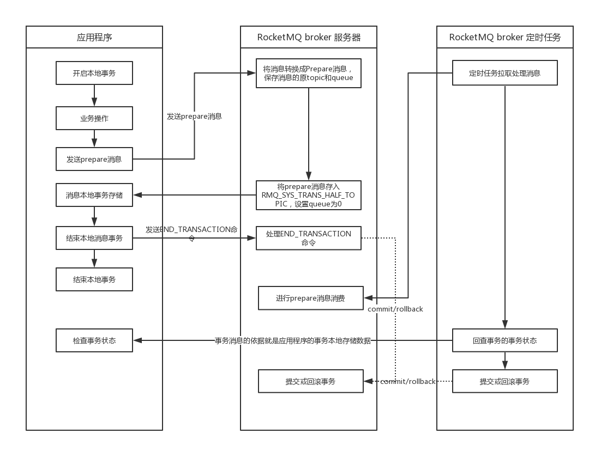

# 流程

`RocketMQ` 事务消息的实现原理基于两阶段提交和定时事务状态回查来决定消息最终是提交还是回滚。

事务消息从发送到处理的整个流程图如下：

RocketMQ事务消息实现原理

**消息本地事务存储** 有几点需要注意

- 该步骤的目的是在应用程序本地事务中存储消息事务数据，这样保证业务数据与消息存储的原子性。如果在 `RocketMQ` 回查事务状态是可以通过业务数据自身的状态判断回查消息的事务状态的话，那就可以不用在本地存储消息事务信息。
- 该步骤是通过调用 `org.apache.rocketmq.client.produce.TransactionListener#executeLocalTransaction` 方法实现的，该方法会返回一个 `LocalTransactionState` ，RocketMQ Producer会根据该返回值来判断是否需要向 RocketMQ broker 发送 commit/rollback 请求来提交或回滚事务消息。而这时本地业务数据存储事务还未结束，所以在`org.apache.rocketmq.client.produce.TransactionListener#executeLocalTransaction` 方法中最好返回 `LocalTransactionState.UNKNOWN`，这样事务消息的提交或回滚就完全依靠 RocketMQ broker的定时任务回查事务状态来完成，以确保上面所说的本地业务数据与消息存储的原子性。

**定时回查事务状态** 有几点需要注意

- 事务消息状态首次回查条件
- 事务消息状态回查间隔时间
- 事务消息状态回查次数限制

## 提交事务消息流程

## 回滚事务消息流程